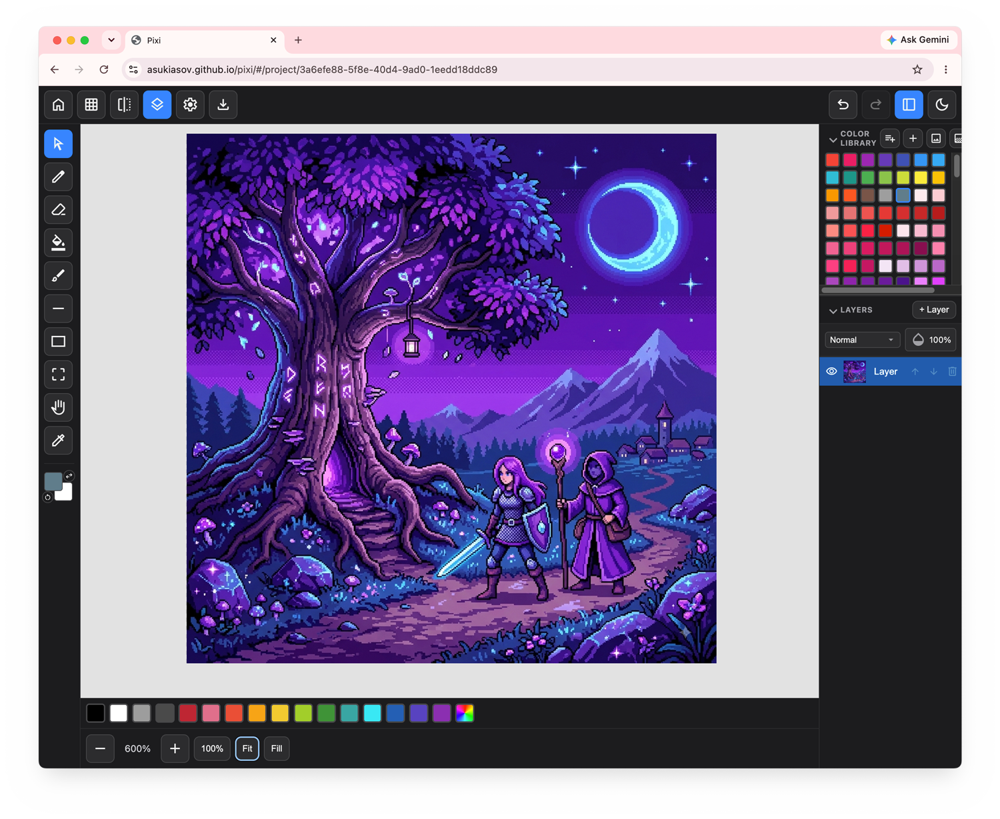

# Pixi

A browser-based pixel art drawing tool. Fixed small canvas sizes
(16/32/64/128px, or custom up to 256px), layers, a full drawing toolset,
local persistence, and export — no animation/frame timeline in this phase.

This is a standalone web app, not a library — there's no npm package, no
mount API, and no framework component to embed in another codebase. Run
it as-is (see Running it locally) or fork the repo.



**Live demo (Standard, free):** https://asukiasov.github.io/pixi/ — no
install, try it now.

**Live demo (Pro, paid):** https://pixi-pro.asukiasov.workers.dev/ — full
Standard + Pro toolset, unrestricted, no watermark. See
[Standard vs. Pro](#standard-vs-pro) below for what Pro adds.

For the full feature set, current phase, and what's built vs. planned, see
[`openspec/roadmap.md`](openspec/roadmap.md). For exactly what each shipped
feature does, [`openspec/specs/`](openspec/specs/) is the source of truth —
this README stays high-level on purpose rather than duplicating that.

## Key Capabilities

- Draw with Pencil, Eraser, Bucket fill, Line, and Rectangle, on fixed
  16/32/64/128px canvases or a custom size up to 256px
- Undo/redo, 20 steps deep
- Predefined and custom brush stamps, click or drag to place
- Export finished art to PNG, at native or scaled resolution, with a
  transparent-background toggle
- Projects save to IndexedDB automatically — usable fully offline, no
  account or sign-in required
- Pro adds Layers, named/persisted color palettes, symmetry drawing, and
  more — see [Standard vs. Pro](#standard-vs-pro)

## Features

Everything below is shipped and usable today in Standard (this repo). See
[`openspec/specs/`](openspec/specs/) for the full behavior of each. For
Pro-only capabilities (Layers, Color Library, Canvas settings, and more),
see [Standard vs. Pro](#standard-vs-pro) below.

| Area | What it does |
|---|---|
| [Canvas creation](openspec/specs/canvas-creation/spec.md) | Fixed size presets (16/32/64/128px) or custom up to 256px, transparent or white background |
| [Drawing engine](openspec/specs/pixel-drawing-engine/spec.md) | Pencil, eraser, bucket fill, undo/redo |
| [Brushes](openspec/specs/brushes/spec.md) | Predefined and custom pixel-pattern stamps, click or drag to place |
| [Shape tools](openspec/specs/shape-tools/spec.md) | Line, rectangle, and a rectangular selection tool (move/copy/delete a region) |
| [Canvas navigation](openspec/specs/canvas-navigation/spec.md) | Zoom in/out, Fit/Fill Screen presets, pan (Hand tool) |
| [Local persistence](openspec/specs/local-persistence/spec.md) | Projects save to IndexedDB automatically — usable fully offline, no account required |
| [Gallery](openspec/specs/gallery/spec.md) | Home screen listing saved projects with thumbnails |
| [Export](openspec/specs/export/spec.md) | PNG export at native or scaled resolution, with a transparent-background toggle |
| [URL routing](openspec/specs/url-routing/spec.md) | Hash-based routes per screen — reload or Back/Forward preserves the open project |

## Standard vs. Pro

Standard (this repo) is free and open-source. Pro adds the tools below, as
a separate private repo built on top of Standard.

| Feature | Standard | Pro |
|---|---|---|
| Pencil, Eraser, Bucket, Shape tools, Brush (manual creation) | ✅ | ✅ |
| Export (PNG/WebP/JPG, scaled), 20-step undo/redo | ✅ | ✅ |
| Pixel-perfect drawing toggle | ❌ | ✅ |
| Symmetry / mirror drawing mode | ❌ | ✅ |
| Layers panel | ❌ | ✅ |
| Color Library (named palettes, import from image, ramp generator) | ❌ | ✅ |
| Brush import from image | ❌ | ✅ |
| Rectangle fill/outline toggle | ❌ | ✅ |
| Pencil/Eraser opacity slider | ❌ | ✅ |
| Canvas Settings (rename/resize/rotate) | ❌ | ✅ |

Pro access is $5, one-time, via PayPal: https://paypal.me/asukiasov — pay,
then email asukiasov@gmail.com with your GitHub username (PayPal doesn't
pass it along) and you'll be added as a collaborator on the private
`pixi-pro` repo, or handed a release archive if you'd rather not have
ongoing GitHub access.

## Stack

Vanilla HTML/CSS/JS with ES modules — **no build step, no bundler, no
framework**. `js/*.js` files are loaded directly by the browser;
CDN-hosted packages are resolved via an [import map](index.html) rather
than npm. Rendering is plain HTML5 Canvas 2D (`getContext('2d')`) — no
WebGL, no WebGPU.

- **Storage**: [Dexie.js](https://dexie.org/) over IndexedDB as the
  offline-first local cache — pixel art projects are saved locally and the
  app is fully usable signed out.
- **`package.json`** exists only to declare test-only dependencies
  (`dexie`, `fake-indexeddb`) for running the test suite under Node — the
  shipped app itself has no npm dependencies.

## Quick Start

Fastest path: open the Standard live demo at
https://asukiasov.github.io/pixi/ — no install. To run it locally
instead, no build/dev server is required — serve the repo root as static
files and open it:

```bash
git clone https://github.com/asukiasov/pixi.git
cd pixi
python3 -m http.server 8000
# then open http://localhost:8000
```

Any static file server works equally well (`npx serve`, VS Code's Live
Server, etc.) — the app just needs to be served over HTTP rather than
opened as a `file://` URL, since ES module imports require it.

## Usage Examples

- **New pixel art sprite:** Gallery → New Canvas, pick a size preset
  (16/32/64/128px) or a custom size up to 256px, then draw with Pencil,
  Bucket fill, and the Shape tools. See
  [Canvas creation](openspec/specs/canvas-creation/spec.md).
- **Reusable stamps:** build a custom brush from a repeated pixel pattern
  and place it with click or drag, instead of redrawing it by hand each
  time. See [Brushes](openspec/specs/brushes/spec.md).
- **Copy/move part of a sprite:** use the rectangular selection tool to
  move, copy, or delete a region without affecting the rest of the
  canvas. See [Shape tools](openspec/specs/shape-tools/spec.md).
- **Multi-layer illustration (Pro):** add Layers, draw each part
  (background, outline, shading) on its own layer, adjust per-layer
  opacity and blend mode, then Export a single flattened PNG. Layers,
  Color Library, and Canvas settings (resize/crop/rotate) are Pro-only —
  see [Standard vs. Pro](#standard-vs-pro).

For the full control-by-control reference, see
[`docs/ui-reference.md`](docs/ui-reference.md).

## Testing

```bash
npm install   # first time only - installs test-only dependencies
npm test      # runs node --test test/**/*.test.js
```

Tests cover DOM-free logic (e.g. engine, layers, undo, persistence,
routing, brushes, shape tools, symmetry, color library — see `test/` for
the full, current list) directly under Node. Anything requiring a real
`<canvas>`/DOM (compositing, rendering) is verified with a Playwright
smoke pass instead — see individual OpenSpec changes'
`tasks.md` under `openspec/changes/archive/` for what was checked.

## Project structure

```
index.html   Single-page shell: Gallery / New Canvas / Workspace screens
style.css    All styles, no preprocessor
js/          ES modules, one per concern (engine, layers, workspace, ...)
test/        node --test unit tests, mirrors js/
openspec/    Requirements (specs/), in-flight change proposals (changes/),
             and the phase-by-phase roadmap.md - see CLAUDE.md for the process
docs/        Reference docs that don't belong in openspec/
scripts/     One-off maintenance scripts (version stamping)
```

For a map of every screen and pixel art tool in the UI (what each control
does, where it lives in the DOM), see
[`docs/ui-reference.md`](docs/ui-reference.md).

## Support the Project

Pixi is solo-built and Standard stays free and open-source. The one way
to support ongoing development directly is buying Pro — see
[Standard vs. Pro](#standard-vs-pro) for what it adds and how access
works ($5, one-time, via PayPal). Bug reports and pull requests against
Standard are also welcome, opened as GitHub issues/PRs on this repo.

## License

[MIT](LICENSE)
